<h1 align="center">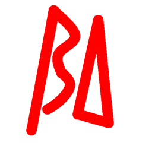 Betadrive</h1>
Betadrive is a mod where you can become an android, granting you the ability to upgrade yourself.
<h2>Items</h2>
<ul>
    <li>
         

            
 Absorption Upgrade

            Increases your max health up to a maximum of 10 hearts (20 HP).
        

    </li>
    <li>
        

            
 Red Pill

            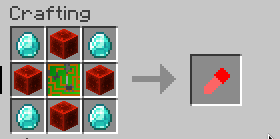 
            The Red Pill allows you to transform into an android.
        

    </li>
    <li>
        

            
 Blue Pill

            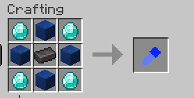 
            The Blue Pill allows you to transform back into a human.
        

    </li>
    <li>
        

            
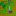 Printed Circuit Board

            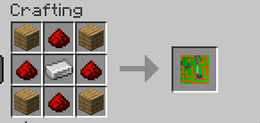 
            The Circuit is a crafting ingredient used for the Red Pill and Robofist.
        

    </li>
    <li>
        

            
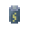 Battery

             
            The Battery fills up an android player's battery all the way to 100%.
        

    </li>
    <li>
        

            
Robofist

             
            The Robofist is a weapon players can use to deal 25 damage in 1 hit. Right-clicking knocks the attacker back in a random direction to the side.
        

    </li>
    <li>
        

            
Display Togglers

            

                
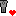 Health Display Toggler

                Toggles the "HP" HUD text which tells you the percent of base max health (20 HP) that you're at.
            

            

                
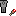 Hunger Display Toggler

                Toggles the "HGR" HUD text which tells you the percent of max hunger (20 HP) that you're at.
            

            

                
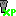 Level Display Toggler

                Toggles the "LVL" HUD text which tells you the XP level that you're at.
            

            

                
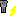 Battery Display Toggler

                Toggles the "BAT" display text which tells you the percent battery that you're at.
            

            

                
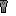 Speed Display Toggler

                Toggles the "MPS" display text which tells you how many blocks/meters per second that you're travelling at.
            

        

    </li>
</ul>
